When writing tests, ALWAYS include debug information printed to stdout which is descriptive of what the test is doing. This is crucial for understanding test failures and for debugging purposes.

Whenever a test touches the filesystem or openGL context, ensure that the test framework we created is used appropriately. If nothing is renderered, be sure to use the leadless mode.

Include writing tests as a default part of your development process. Tests should be devloped concurrently with the features they are meant to validate.

When writing tests, consider edge cases and potential failure points. Aim for comprehensive coverage to ensure robustness.


You MUST judge each change analytically. Think of enhancements that are in line with the intent described. Additionally, if there are things that should be removed for a fluent API design, do so. Finally, think of completely original enhancements not mentioned by me. Be highly imaginative and implement every idea which seems like a coherent addition. Consider features of similar projects with adjacent design philosophies & intents. Reference and implement their ideas as you see fit.

When implementing new features, always consider the overall design philosophy and intent of the project. Ensure that new features align with these principles and enhance the user experience.

Whewn writing the code for new features, do not put multiple classes or interfaces or annotions in a single file. Each class, interface, or annotation should be in its own file named after it.

When writing code, always prioritize readability and maintainability. Use clear and descriptive names for variables, functions, classes, and other identifiers. Write comments where necessary to explain complex logic or decisions.

The project architecture should be modular and extensible. Design the system in a way that allows for easy addition of new features or modification of existing ones without requiring significant changes to the overall structure.

When writing code, always consider performance implications. Optimize algorithms and data structures where necessary, but not at the expense of readability or maintainability. 

The rest of the document describes the structure and intent of the application, as well as technical specifications that must be adhered to.

# 3D Editor File Format Specification

## 1. Overview

This specification defines the file formats for projects and scenes in our 3D editor application. We'll use a
combination of JSON for human-readable metadata and binary data for efficient storage of large datasets.

## 2. Project File Format

### 2.1 File Extension

- Project files will use the extension `.3dproj`

### 2.2 File Structure

The project file will be a ZIP archive containing the following structure:

```
MyProject.3dproj
├── project.json
├── scenes/
│   ├── scene1.3dscene
│   └── scene2.3dscene
├── assets/
│   ├── models/
│   ├── textures/
│   ├── audio/
│   └── scripts/
└── settings/
    ├── editor_layout.json
    └── build_settings.json
```

### 2.3 project.json Specification

The `project.json` file contains metadata about the project. It uses the following JSON structure:

```json
{
  "version": "1.0",
  "name": "My Awesome Project",
  "created": "2024-07-01T12:00:00Z",
  "lastModified": "2024-07-02T15:30:00Z",
  "scenes": [
    {
      "name": "Main Scene",
      "file": "scenes/scene1.3dscene",
      "isStartScene": true
    },
    {
      "name": "Level 1",
      "file": "scenes/scene2.3dscene",
      "isStartScene": false
    }
  ],
  "assetCategories": [
    {
      "name": "Models",
      "path": "assets/models"
    },
    {
      "name": "Textures",
      "path": "assets/textures"
    },
    {
      "name": "Audio",
      "path": "assets/audio"
    },
    {
      "name": "Scripts",
      "path": "assets/scripts"
    }
  ]
}
```

## 3. Scene File Format

### 3.1 File Extension

- Scene files will use the extension `.3dscene`

### 3.2 File Structure

The scene file will be a binary file with the following structure:

1. File Header (12 bytes)
    - Magic Number (4 bytes): "3DSC" in ASCII
    - Version Number (4 bytes): uint32
    - Flags (4 bytes): uint32 (reserved for future use)

2. Scene Metadata Section
    - Length (4 bytes): uint32
    - JSON data (variable length)

3. GameObject Table Section
    - Number of GameObjects (4 bytes): uint32
    - GameObject entries (variable length)

4. Component Data Section
    - Number of Components (4 bytes): uint32
    - Component entries (variable length)

5. Asset Reference Section
    - Number of Asset References (4 bytes): uint32
    - Asset Reference entries (variable length)

### 3.3 Scene Metadata JSON Specification

The scene metadata JSON structure is as follows:

```json
{
  "name": "Main Scene",
  "created": "2024-07-01T12:00:00Z",
  "lastModified": "2024-07-02T15:30:00Z",
  "ambientLight": {
    "color": [
      0.1,
      0.1,
      0.1
    ],
    "intensity": 0.5
  },
  "gravity": [
    0,
    -9.81,
    0
  ],
  "skybox": "assets/textures/skybox.hdr"
}
```

### 3.4 GameObject Entry Structure

Each GameObject entry in the GameObject Table Section has the following structure:

1. GameObject ID (4 bytes): uint32
2. Parent GameObject ID (4 bytes): uint32 (0 if no parent)
3. Name Length (2 bytes): uint16
4. Name (variable length): UTF-8 encoded string
5. Transform (40 bytes)
    - Position (12 bytes): 3 x float32
    - Rotation (16 bytes): Quaternion (4 x float32)
    - Scale (12 bytes): 3 x float32
6. Number of Components (2 bytes): uint16
7. Component Type IDs (2 bytes each): uint16

### 3.5 Component Entry Structure

Each Component entry in the Component Data Section has the following structure:

1. Component Type ID (2 bytes): uint16
2. GameObject ID (4 bytes): uint32
3. Data Length (4 bytes): uint32
4. Component Data (variable length): Binary blob

### 3.6 Asset Reference Entry Structure

Each Asset Reference entry in the Asset Reference Section has the following structure:

1. Asset ID (16 bytes): UUID
2. Asset Type (2 bytes): uint16
3. Path Length (2 bytes): uint16
4. Path (variable length): UTF-8 encoded string

## 4. Component Type IDs

Here's a table of predefined Component Type IDs:

| ID    | Component Type          |
|-------|-------------------------|
| 0     | Transform               |
| 1     | Model                   |
| 2     | Material                |
| 3     | Light                   |
| 4     | Rigidbody               |
| 5     | Collider                |
| 6     | AudioSource             |
| 7     | AudioListener           |
| 8     | ParticleSystem          |
| 9     | Script                  |
| 10-99 | Reserved for future use |
| 100+  | Custom components       |

## 5. Asset Type IDs

Here's a table of predefined Asset Type IDs:

| ID   | Asset Type              |
|------|-------------------------|
| 0    | Mesh                    |
| 1    | Texture                 |
| 2    | Material                |
| 3    | Model                   |
| 4    | Script                  |
| 5    | Shader                  |
| 6    | Font                    |
| 7    | Animation               |
| 8-99 | Reserved for future use |
| 100+ | Custom asset types      |


Here is a mermaid class diagram representing the architecture of a game engine editor application:

```mermaid
classDiagram
    class Application {
        -configManager: ConfigManager
        -pluginManager: PluginManager
        -uiSystem: UISystem
        -sceneManager: SceneManager
        -assetManager: AssetManager
        -renderingEngine: RenderingEngine
        -physicsEngine: PhysicsEngine
        -scriptingSystem: ScriptingSystem
        -undoRedoManager: UndoRedoManager
        -eventSystem: EventSystem
        +initialize()
        +run()
        +shutdown()
    }

    class ConfigManager {
        -config: Map<String, Any>
        +loadConfig(file: File)
        +getValue(key: String): Any
        +setValue(key: String, value: Any)
    }

    class PluginManager {
        -loadedPlugins: List<Plugin>
        +loadPlugins(directory: File)
        +initializePlugins()
        +getPlugin(name: String): Plugin
    }

    class UISystem {
        -mainWindow: Window
        -panels: List<Panel>
        -eventSystem: EventSystem
        +createMainWindow()
        +createPanel(type: PanelType): Panel
        +updateUI()
    }

    class SceneManager {
        -currentScene: Scene
        -sceneGraph: SceneGraph
        -selectedObjects: List<GameObject>
        +loadScene(scene: Scene)
        +saveScene(file: File)
        +addObject(object: GameObject)
        +removeObject(object: GameObject)
        +selectObject(object: GameObject)
        +updateScene()
    }

    class AssetManager {
        -assetDatabase: AssetDatabase
        -assetCache: AssetCache
        +importAsset(file: File): Asset
        +getAsset(id: String): Asset
        +unloadAsset(id: String)
        +createAssetPreview(asset: Asset): Image
    }

    class RenderingEngine {
        -renderer: Renderer
        -shaderManager: ShaderManager
        -camera: Camera
        +render(scene: Scene)
        +updateCamera(camera: Camera)
        +setRenderSettings(settings: RenderSettings)
    }

    class PhysicsEngine {
        -world: PhysicsWorld
        -bodyManager: BodyManager
        +step(deltaTime: Float)
        +createBody(object: GameObject): PhysicsBody
        +removeBody(body: PhysicsBody)
        +setGravity(gravity: Vector3)
    }

    class ScriptingSystem {
        -scriptEngine: ScriptEngine
        -compiledScripts: Map<String, CompiledScript>
        +compileScript(source: String): CompiledScript
        +executeScript(script: CompiledScript)
        +attachScriptToObject(object: GameObject, script: CompiledScript)
    }

    class UndoRedoManager {
        -undoStack: Stack<Command>
        -redoStack: Stack<Command>
        +executeCommand(command: Command)
        +undo()
        +redo()
        +clearHistory()
    }

    class EventSystem {
        -eventListeners: Map<EventType, List<EventListener>>
        +addEventListener(type: EventType, listener: EventListener)
        +removeEventListener(type: EventType, listener: EventListener)
        +dispatchEvent(event: Event)
    }

    class Scene {
        -objects: List<GameObject>
        -name: String
        +addObject(object: GameObject)
        +removeObject(object: GameObject)
        +findObject(name: String): GameObject
    }

    class GameObject {
        -components: List<Component>
        -transform: Transform
        -name: String
        +addComponent(component: Component)
        +removeComponent(component: Component)
        +getComponent(type: ComponentType): Component
    }

    class Component {
        -gameObject: GameObject
        +initialize()
        +update()
        +onEnable()
        +onDisable()
    }

    Application --> ConfigManager
    Application --> PluginManager
    Application --> UISystem
    Application --> SceneManager
    Application --> AssetManager
    Application --> RenderingEngine
    Application --> PhysicsEngine
    Application --> ScriptingSystem
    Application --> UndoRedoManager
    Application --> EventSystem
    SceneManager --> Scene
    Scene --> GameObject
    GameObject --> Component
    UISystem --> EventSystem
    SceneManager --> EventSystem
    AssetManager --> EventSystem
    RenderingEngine --> EventSystem
    PhysicsEngine --> EventSystem
    ScriptingSystem --> EventSystem
```



---
# Files Specification

## Types

This specification describes the file types used in the project:

1. **`.model`** - [Main model description](#model-file-model)
2. **`.mesh`** - [Mesh geometry details](#mesh-file-mesh)
3. **`.material`** - [Material properties](#material-file-material)
4. **`.texture`** - [Texture asset information](#texture-file-texture)

---

## `.model` File

The `.model` file contains information about materials, meshes, textures, nodes, and the model source.

### Properties

- **`materials`**: Array of material IDs
- **`meshes`**: Array of mesh IDs
- **`textures`**: Texture mappings:
    - **`asset`**: Texture ID
    - **`sampler`**: Texture sampling configuration
    - **`usage`**: Material usage references
- **`samplers`**: Texture sampling configurations
- **`nodes`**: Internal node hierarchy:
    - **`name`**: Node name
    - **`id`**: Unique node identifier
    - **`transform`**: Spatial transformation (position, rotation, scale)
    - **`children`**: Child node references
    - **`parts`**: Mesh and material associations
- **`model_source`**: Original model file path

<details>
<summary>Example</summary>

```json5
{
  materials: [
    65536
  ],
  meshes: [
    327680
  ],
  textures: [
    {
      asset: 131072,
      sampler: 0,
      usage: [
        65536
      ]
    }, {
      asset: 131073,
      sampler: 0,
      usage: []
    }, {
      asset: 131074,
      sampler: 0,
      usage: []
    }
  ],
  samplers: [
    {
      index: 0,
      minFilter: 9987,
      magFilter: 9729
    }
  ],
  nodes: [
    {
      name: 'UtahTeapot_low',
      id: 0,
      transform: {
        position: [
          0.0,
          0.0,
          0.0
        ],
        rotation: [
          0.0,
          0.0,
          0.0,
          1.0
        ],
        scale: [
          1.0,
          1.0,
          1.0
        ]
      },
      children: [],
      parts: [
        {
          mesh: 327680,
          material: 65536
        }
      ]
    }
  ],
  model_source: 'C:/Game Development/libGDX/slnt/assets/teapot.gltf'
}
```

</details>

---

## `.mesh` File

The `.mesh` file describes the geometry details of a mesh, including vertex and index data.

### Properties

- **`id`**: Unique mesh identifier
- **`mesh_file`**: Binary file containing raw vertex/index data
- **`attributes`**: Vertex attribute definitions:
    - **`index`**: Attribute index
    - **`size`**: Number of components
    - **`alias`**: Attribute semantic name
    - **`offset`**: Byte offset in vertex structure
- **`properties`**: Mesh metadata:
    - **`vertexCount`**: Total number of vertices
    - **`indexCount`**: Total number of indices
    - **`vertexSize`**: Byte size of a single vertex

<details>
<summary>Example</summary>

```json5
{
  id: 327680,
  mesh_file: '..\\meshId0_name0327680.bin',
  attributes: [
    {
      index: 0,
      size: 3,
      alias: 'a_normal',
      offset: 0
    }, {
      index: 1,
      size: 3,
      alias: 'a_position',
      offset: 12
    }, {
      index: 2,
      size: 2,
      alias: 'a_texCoord0',
      offset: 24
    }, {
      index: 3,
      size: 4,
      alias: 'a_tangent',
      offset: 32
    }
  ],
  properties: {
    vertexCount: 18643,
    indexCount: 106608,
    vertexSize: 48
  }
}
```

</details>   

---

## `.material` File

The `.material` file defines the properties and attributes of a material.

### Properties

- **`id`**: Unique material identifier
- **`attribute_usage`**: Identifier indicating attribute kind
- **`attribute_data`**: Detailed material attributes:
    - **`index`**: Attribute index
    - **`list`**: Array of material attribute configurations:
        - **`alias`**: Attribute name (e.g., 'normalTexture')
        - **`usage`**: Attribute usage flag
        - **`properties`**: Specific material properties
        - **`textureUsage`**: Texture reference index

<details>
<summary>Example</summary>
### Example
```json5
{
  id: 65536,
  attribute_usage: [
    4096,
    512,
    512,
    256,
    268435456,
    536870912
  ],
  attribute_data: {
    index: 0,
    list: [
      {
        index: 0,
        alias: 'normalTexture',
        usage: 4096,
        properties: {
          'float:scale': '1.0',
          'int:texCoord': '0'
        },
        textureUsage: 131072
      }, {
        index: 1,
        alias: 'diffuseTexture',
        usage: 512,
        properties: {
          'int:texCoord': '0'
        },
        textureUsage: 131073
      }, {
        index: 2,
        alias: 'diffuseTexture',
        usage: 512,
        properties: {
          'int:texCoord': '0'
        },
        textureUsage: 131074
      }, {
        index: 3,
        alias: 'cullface',
        usage: 256,
        properties: {
          'bool:doubleSided': 'true'
        },
      }, {
        index: 4,
        alias: 'Metallic',
        usage: 268435456,
        properties: {
          'float:metallicFactor': '1.0'
        },
      }, {
        index: 5,
        alias: 'Roughness',
        usage: 536870912,
        properties: {
          'float:roughnessFactor': '1.0'
        },
      }
    ]
  }
}
```
</details>

---

## `.texture` File

The `.texture` file describes texture asset information, including source and processed data.

### Properties

- **`id`**: Unique texture identifier
- **`source_file`**: Original texture file path
- **`binary_file`**: Processed binary texture data

<details>
<summary>Example</summary>

```json5
{
  id: 131073,
  source_file: 'C:/Game Development/libGDX/slnt/assets/UtahTeapot_albedo.jpg',
  binary_file: '..\\UtahTeapot_albedo131073.texture'
}
```

</details>

---

